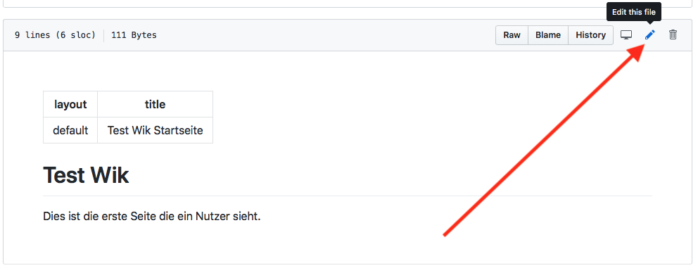
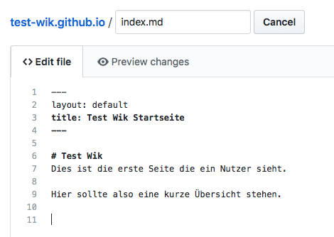
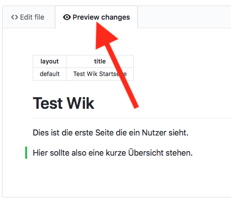
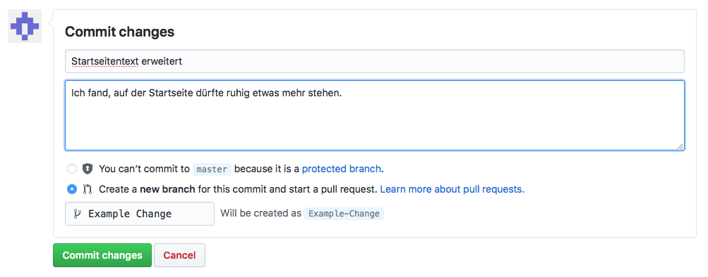
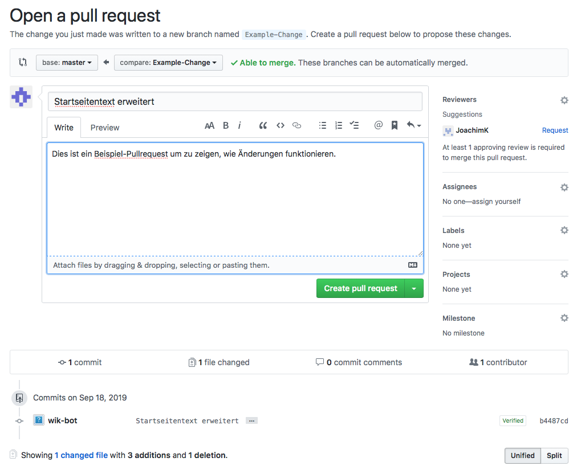
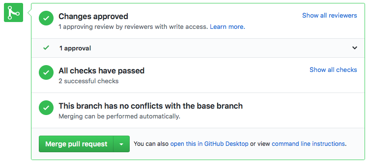

## Willkommen zum Stadtteilgenossenschaft Wik GitHub Pages Testen

* [Voraussetzungen zum Mitmachen](#voraussetzungen-zum-mitmachen)
* [Änderungen machen](#änderungen-machen)
* [Mehrere Dateien gleichzeitig ändern](#mehrere-dateien-gleichzeitig-ändern)
* [Neue Seiten anlegen](#neue-seiten-anlegen)
* [Bilder hinzufügen](#bilder-hinzufügen)
* [Markdown](#markdown)

### Voraussetzungen zum Mitmachen

* Browser
* Ein GitHub Account
* Mitgliedschaft in der `test-wik` Organisation

#### GitHub Account
Registriere dich einfach [hier bei GitHub](https://github.com/join) um einen Account anzulegen. 

Du wirst bei der Registrierung gefragt welche "Subscription" du wählen möchtest. `Free` reicht hier vollkommen um mitzumachen und alle Funktionen zu nutzen, wähle also diese Option. Es gibt auch keine versteckten Kosten, du musst keine Kreditkartendaten o.ä. angeben und auch sonst musst du dir keine Sorgen machen, dass GitHub plötzlich kostenoflichtig wird.

#### Mitgliedschaft in der test-wik Organisation 
Die Website liegt in einem sogenannten **Repository**. Das sind in diesem Fall all die Dateien unter https://github.com/test-wik/test-wik.github.io inklusive aller [vorheriger Versionen](https://github.com/test-wik/test-wik.github.io/commits/master). Um die Website zu ändern musst du die [Dateien im Repository](https://github.com/test-wik/test-wik.github.io) ändern. Und um das zu können, musst du Mitglied der [test-wik Gruppe](https://github.com/orgs/test-wik/people) sein.

Daher melde dich bitte nach dem Erstellen deines Accounts kurz in [diesem Thema im Forum](https://forum.stadtteilgenossenschaft-wik.de/t/website-bauen-mit-github-pages-test/136) und schreibe dort deinen GitHub Accountnamen, damit du zur test-wik Gruppe einladen und du die richtigen Zugriffsrechte bekommst. 

### Änderungen machen

#### Editor

Sobald du Mitglied der test-wik Gruppe bist und somit Änderungen machen kannst, kannst du irgendeine der Dateien wählen und editieren. Das geht indem du auf eine der Dateien klickst und dann oben rechts auf den Stift klickst.



Daraufhin öffnet sich ein Editor, der dir erlaubt beliebige Änderungen zu machen. 



Probiere ruhig etwas herum, du kannst nichts kaputt machen, denn

1. werden deine Änderungen in einer separaten Version gespeichert, die nicht die Hauptversion ist
2. Ist dies hier nur eine Test-Website die dazu gedacht ist Dinge auszuprobieren

Die Art und Weise wie du Formatierungen beschreibst nennt sich [Markdown](#markdown) (siehe unten). Um eine Idee zu bekommen wie deine Änderungen formatiert aussehen (z.B. fett, Überschriften, Links, Bilder) und welche Änderungen du gemacht hast, klicke auf den "Preview changes" tab oben links. 



Wenn du mit deinen Änderungen zufrieden bist, kannst du eine neue "Variante" speichern. Eine Variante heißt im GitHub Sprech "branch", da es verschiedene "Verzweigungen" der Hauptversion sind. Um eine neue Version einer Variante zu speichern, "commit"et man sie. 

#### Branches, Commits und Pull Requests

Scrolle daher nun runter bist zum Bereich "Commit changes" unter dem Editor. 



Gib dort ein paar Informationen ein, was für eine Änderung du gemacht hast, damit es einfacher ist diese zu verstehen und später wiederzufinden. Meist bietet es sich an einen Titel von wenigen Worten zu nutzen und dann bei Bedarf genaueres im Textfeld darunter zu erklären. Was du hier schreibst taucht nachher in der [Versionshistorie](https://github.com/test-wik/test-wik.github.io/commits/master) auf.

Wähle außerdem einen Namen für deine Variante/Änderungen und trage diesen in das letzte Feld ein. GitHub macht dir hier einen Vorschlag, aber lauter Namen wie `joachim-patch-1`, `joachim-patch-2`, `joachim-patch-3` zu haben wird schnell verwirrend, daher ist es auch hier besser einen sprechenden Namen zu wählen. Wenn du z.B. einen Blogpost über die MTS schreiben willst könntest du deine Variante `blogpost-mts` nennen.


#### Pull Request erstellen

Nun hast du eine neue Variante erstellt. Diese Variante wird aber noch nicht für die tatsächliche Website genutzt. GitHub schlägt nun direkt als nächstes vor einen "Pull Request" zu erstellen. Das bedeutet, dass du vorschlägst, die Änderungen, die du gemacht hast zur "Haupt"-Variante (`master`) hinzuzufügen. 



Beschreibe hier nochmal kurz deine Änderungen. (Wenn du nur einen "Commit" vorher gemacht hast, übernimmt GitHub die Beschreibung von dir für dich) Weiyer unten siehst du auch nochmal welche Änderungen an welchen Dateien du gerade vorschlägst.

Du kannst deine Variante auch noch weiter editieren ohne einen Pull-Request zu erstellen, ein Pull-Request hat aber den Vorteil, dass eine Vorschau der Website für dich erstellt wird. Klicke daher nun auf den "Create pull request" button. Das Ergebnis sollte etwas so aussehen: https://github.com/test-wik/test-wik.github.io/pull/17 

Nun passieren zwei Dinge. 

#### Vorschau
Zum einen wird ein Bot gestartet, der die Website neuberechnet mit deinen Änderungen. Der Bot wird nach der Fertigstellung einen Kommentar mit einem Link zur Vorschau deiner Änderungen zu deinem Pull Request schreiben. 


Das alles geklappt hat siehst du auch an dem grünen Haken unter "All checks have passed". Klicke auf den Link, um zu sehen wie die Website aussehen würde, wenn deine Änderungen übernommen würden. 

#### Review
Außerdem sehen jetzt alle anderen welche Änderungen du vorschlägst. Sie können sich die Änderungen an den Dateien ansehen und auch die Vorschau. Dieser Prozess der Prüfung durch eine(n) Andere(n) nennt sich "Review". Und wenn sie damit einverstanden sind, können sie deinen Pull Request "bestätigen".

Du brauchst mindestens eine Bestätigung von einem anderen Mitglied der Gruppe, um deine Änderungen in die Hauptversion (und damit die aktuelle Website) zu übernehmen.

#### Merge
Sobald du die Bestätigung eines anderen Mitglied bekommen hast und sofern der erfolgreich eine Vorschau der Website erstellen konnte sollten alle Punkte auf der Checklist unter deinem Pull Request grün sein und dann auch der "Merge"-Button grün sein.



"Merge" bedeutet "zusammenfügen"/"verschmelzen", wenn du diesen Button drückst, werden deine Änderung mit der Hauptversion der Website zusammengeführt. Drücke also nun den "Merge pull request" button. Danach wird unten eine Nachricht erscheinen "Pull-request successfully merged and closed".


Klicke noch auf den "Delete branch" Button um deine Arbeitsvariante zu löschen, denn diese ist nun Teil der "Hauptversion" und wird nicht mehr benötigt. Das ist nicht zwingend nötig, macht es aber einfacher für alle den Überblick zu behalten, an welchen Varianten gerade gearbeitet wird.

Mit dem Übernehmen der Änderungen in die Hauptversion wird die Website aktualisiert. Dies kann ein paar Minuten dauern. Die aktuelle Version der Website findest du unter http://test-wik.github.io.

Das alles mag sich nach recht viel Aufwand und vielen doppelten Schritten anfühlen. Es macht etwas mehr Sinn, wenn man mehrere Dateien gleichzeitig ändert.

### Mehrere Dateien gleichzeitig ändern

ToDo

### Neue Seiten anlegen

ToDo

### Bilder hinzufügen

ToDo

### Markdown

Markdown is a lightweight and easy-to-use syntax for styling your writing. It includes conventions for

```markdown
Syntax highlighted code block

# Header 1
## Header 2
### Header 3

- Bulleted
- List

1. Numbered
2. List

**Bold** and _Italic_ and `Code` text

[Link](url) and 
```

For more details see [GitHub Flavored Markdown](https://guides.github.com/features/mastering-markdown/).

### Jekyll Themes

Your Pages site will use the layout and styles from the Jekyll theme you have selected in your [repository settings](https://github.com/test-wik/test-wik.github.io/settings). The name of this theme is saved in the Jekyll `_config.yml` configuration file.

### Support or Contact

Having trouble with Pages? Check out our [documentation](https://help.github.com/categories/github-pages-basics/) or [contact support](https://github.com/contact) and we’ll help you sort it out.
